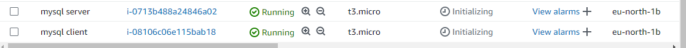
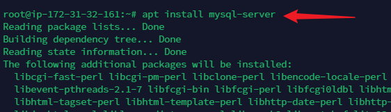
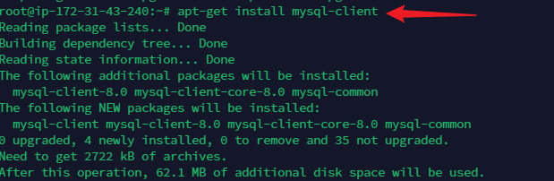
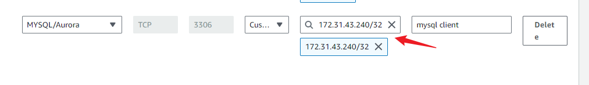
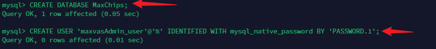
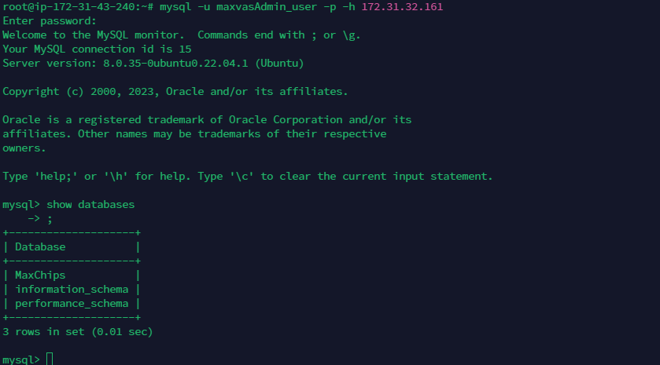
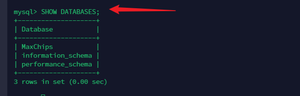
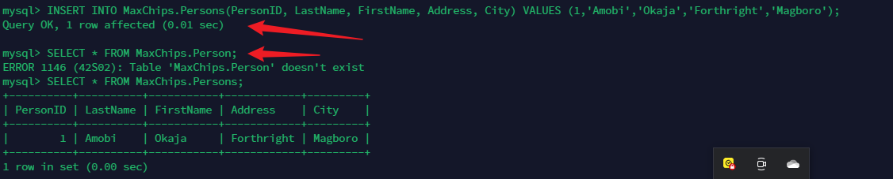

# ClientServerWithMysql
## Introduction
Client-Server refers to an architecture in which two or more computers are connected together over a network to send and receive requests between one another.

In their communicaton, each machine has its own role: the machine sending requests is ususally referred as "Cleint" and the machine responding (serving) is called "Server".

In this project, the Client Server Architecture would be implemented using MySQL Datatbase Management System(DBMS).

##  Steps

1. Create and configure two Linux-based virtual Servers (EC2 instances in AWS)
- Server A name- mysql server
- Server B name -mysql client

2. On mysql server Linux Server install MySql Server Software

3. On mysql client Linux Server install MySQL Client Software

4. By default, both of your EC2 virtial servers are located in the same local virtual network, so they can communicate to each other using local IP addresses.

-  Use *mysql server's* local IP addresses to connect from *mysql client*.  

- MySql Server Private IP address: 172.31.32.161
- MySql Client Private IP address: 172.31.43.240
- By default the MySQL servers uses TCP port 3306. This would be opened by creating new entry 'Inbound rules' in *mysql server' Security Groups. For extra security, only the specific local IP address of mysql client would be allowed. Other IP addresses would not be allowed

5. To allow MqSQL server to allow connects from remote hosts we have to edit the mysqld.cnf file and replace the bind-address from 127.0.0.1 to 0.0.0.0

6. Create Database in mysql Server and grant permission to mysql client

The image below shows that database name MaxChips in the mysql Server Linux Server and a user maxvasAdmin_user was also created

The maxvasvasAdmin_user was also granted permission to perform operations on the MaxChips Data base

7. Check that you have successfully connected to a remote MySql server and can perform SQL queries from the Mysql client

The image below shows the connection from mysql client  Linux server to the mysql Server Linux server.

The image below shows the sucessfull query of the mysql server from mysql client showing the database named MaxChips

- To show Database

- To Create Table named Persons

- To Insert and Select data into the Persons Table

